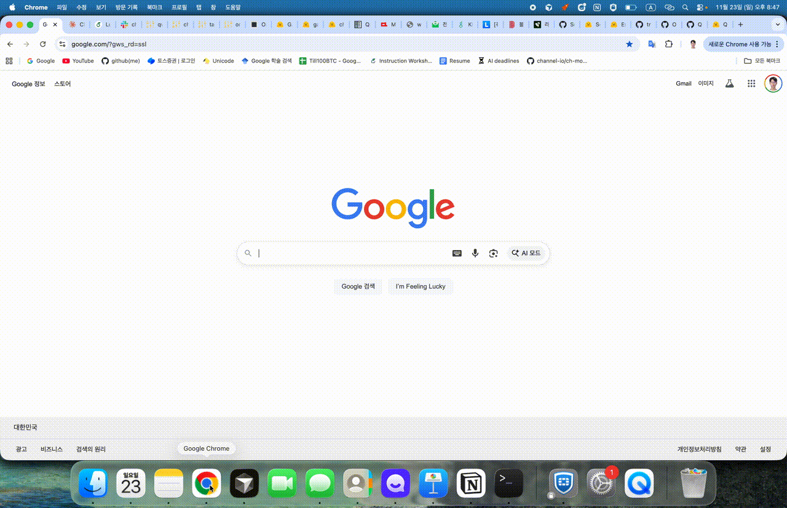
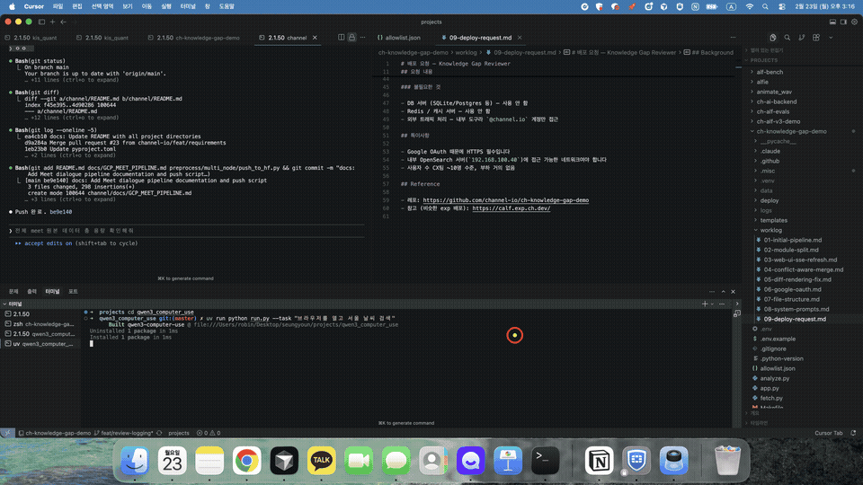

# Qwen3 Computer Use

A minimal Qwen3 GUI agent driver. It exposes the `computer_use` tool on a vLLM (OpenAI compatible) endpoint and directly controls the local mouse, keyboard, and screenshot capture via `pyautogui`/`mss`.

## Demo

| Model | Task | Demo |
|-------|------|------|
| Qwen3-VL-30B-A3B-Instruct | GitHub issue resolution |  |
| Qwen3.5-397B-A17B-FP8 | Weather search in Seoul |  |

## Requirements
- Python 3.10+
- GUI control permission (X11/Wayland/VNC, physical or virtual display)
- An OpenAI compatible server hosting a Qwen3 model (e.g., `http://localhost:8000/v1`)

## Installation
```bash
git clone https://github.com/SeungyounShin/qwen3_computer_use.git
cd ./qwen3_computer_use
uv sync
```

## Start the vLLM server
Launch vLLM before running the agent:

```bash
CUDA_VISIBLE_DEVICES=2,3 vllm serve Qwen/Qwen3-VL-30B-A3B-Instruct \
  --tensor-parallel-size 2 \
  --limit-mm-per-prompt.video 0 \
  --async-scheduling \
  --max-model-len 16392 \
  --enable-auto-tool-choice \
  --tool-call-parser hermes
```

## Run
```bash
uv run python run.py \
  --model "Qwen/Qwen3-VL-30B-A3B-Instruct" \
  --task "Open a browser and download the ACL 2026 template." \
  --base-url "http://192.168.100.30:8000/v1" \
  --api-key "EMPTY" \
  --screenshot-dir /tmp/qwen3-shots
```

Key options:
- `--max-turns`: Maximum number of model calls (default 200)
- `--monitor-index`: `mss` monitor index (default 1, see `mss().monitors`)
- `--mouse-move-duration` / `--drag-duration`: Pointer move/drag duration in seconds

Every physical action the agent performs is captured as a screenshot (Base64) with cursor coordinates and fed back to the model. The model must always finish with `answer` → `terminate`.

## Notes
- `pyautogui.FAILSAFE` is disabled, so run tests inside a sandboxed VM/container for safety.
- Extend the `ComputerUseTool` or `ComputerUseAgent` classes if you need additional logging or state management.

